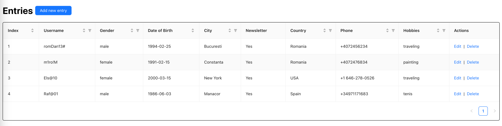

# Table with entries App

This project displays an table with entries, 2 forms for add new entry, edit entry, and also each entry can be delete it.
In the project was used ReactJS, React-Hooks, Typescript, SCSS, also was used Ant Design(https://ant.design/components/overview/)

The items required in the form are as follows:

- Username (Input type, required field, pattern must include lowercase letters, uppercase letters, !@#, and numbers, with a character limit of 4 to 80)
- First name (Input type, required field, pattern must include lowercase letters, uppercase letters, and ' , with a character limit of 2 to 80)
- Last name (Input type, required field, pattern must include lowercase letters, uppercase letters, and ' with a character limit of 2 to 80)
- Gender (Switch type, not mandatory)
- Date of birth (Date picker type, required field, only accepts dates that are 18 years ago or more from the current date)
- Address (Input type, not mandatory)
- City (Input type, not mandatory)
- Register to newsletter (Checkbox type, not mandatory)
- Country (Dropdown type, not mandatory)
- Phone (Input type, not mandatory, must include country code and phone number)
- Details (Textarea type, not mandatory)
- Hobbies (Textarea type, not mandatory)

the table will be:

the add entry form will be:

the edit entry form will be:

## commands

In the project directory, you can run:

### `npm start`

to start the project
